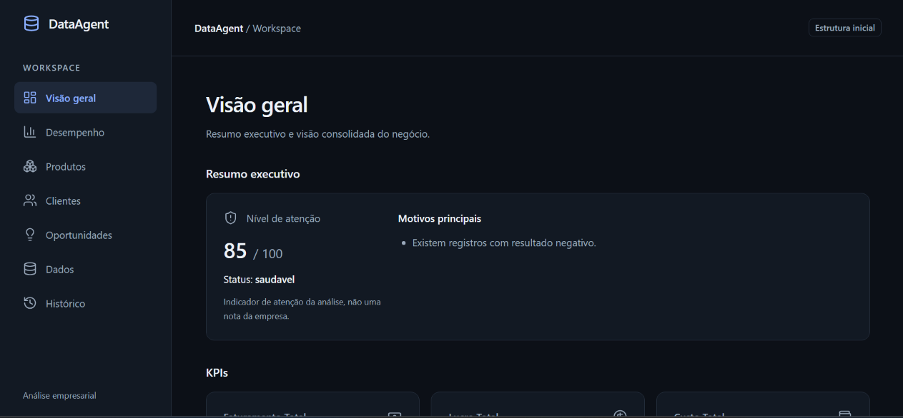
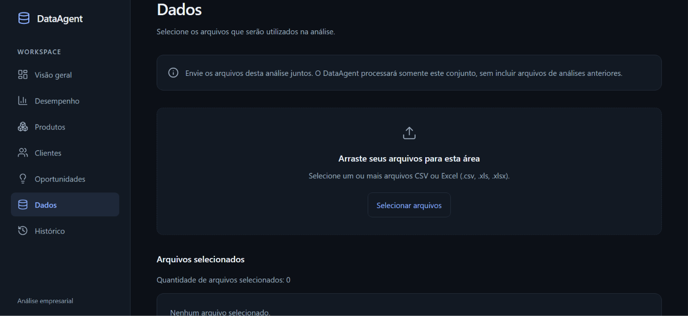
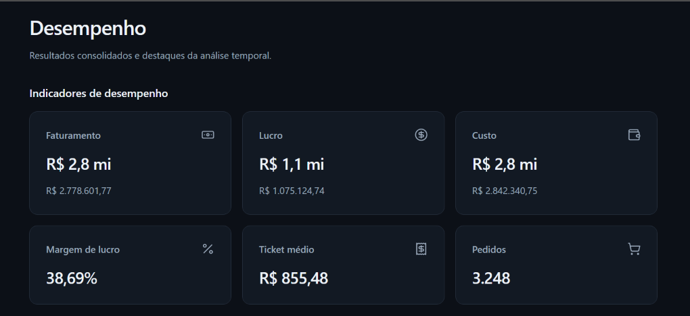
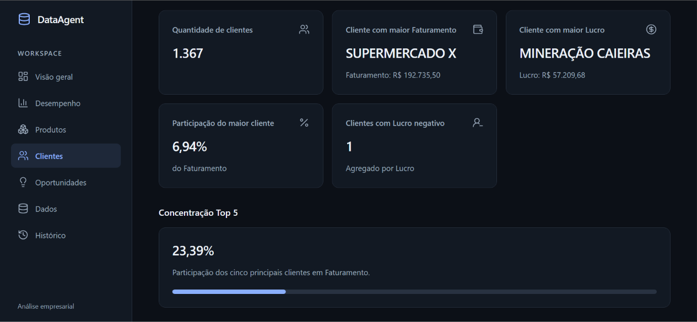
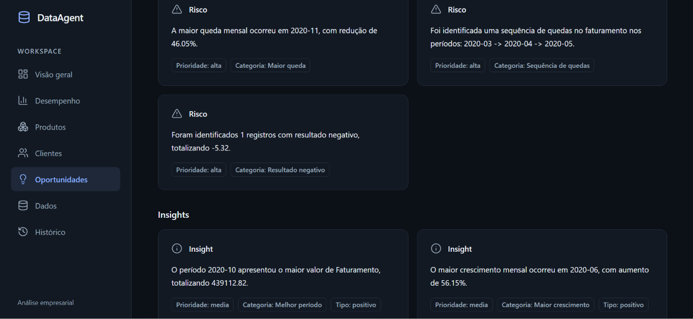

# DataAgent

<p align="center">
  <strong>Automação de ingestão, tratamento, análise e interpretação de dados tabulares.</strong>
</p>

<p align="center">
  Python • Pandas • NumPy • FastAPI • React • TypeScript • Vite • Tailwind CSS
</p>

<p align="center">
  <strong>Versão atual: v1.5.0 — Analytical Intelligence</strong>
</p>

<p align="center">
  
</p>

<p align="center">
  <em>Visão Geral do DataAgent com resumo executivo, KPIs e resultados da análise.</em>
</p>

---

## Sobre o DataAgent

O **DataAgent** é uma aplicação full stack desenvolvida para automatizar grande parte do processo existente entre receber uma base de dados e transformá-la em informações úteis para análise.

O sistema recebe arquivos **CSV e Excel**, inspeciona sua estrutura, identifica problemas de qualidade, realiza etapas de ETL, interpreta conceitos de negócio, relaciona múltiplas tabelas, calcula métricas, analisa clientes, produtos e períodos e transforma evidências encontradas nos dados em achados analíticos estruturados.

O projeto foi desenvolvido com uma preocupação central:

> **Automatizar o que pode ser determinado com segurança e solicitar intervenção humana quando os dados não fornecem evidência suficiente para uma decisão confiável.**

Por isso, o DataAgent não tenta simplesmente transformar qualquer planilha em um dashboard.

Antes da análise, o sistema procura entender:

- Como o arquivo está estruturado;
- Quais colunas existem;
- Quais tipos de dados estão presentes;
- Quais conceitos de negócio podem ser identificados;
- Quais métricas podem realmente ser calculadas;
- Quais arquivos possuem relacionamentos;
- Quais problemas de qualidade existem;
- Quais entidades podem estar duplicadas;
- Quais comparações são semanticamente válidas;
- Quais conclusões possuem evidências suficientes para serem apresentadas.

A versão **v1.5.0** representa a conclusão da primeira grande versão funcional do projeto.

---

# Interface da aplicação

O DataAgent possui uma interface web desenvolvida para concentrar todo o fluxo de análise em um único ambiente.

A aplicação permite realizar o upload dos dados, acompanhar indicadores encontrados pelo pipeline, explorar clientes e produtos, visualizar problemas de qualidade, analisar achados e consultar análises anteriores.

A navegação é organizada nas áreas:

- **Visão Geral**
- **Desempenho**
- **Produtos**
- **Clientes**
- **Oportunidades**
- **Dados**
- **Histórico**

---

## Upload e análise dos dados

A página **Dados** funciona como ponto de entrada para novas análises.

O usuário pode enviar um ou vários arquivos CSV ou Excel. Cada nova análise utiliza somente o conjunto de arquivos selecionado para aquela execução.

<p align="center">
  
</p>

<p align="center">
  <em>Área de upload para arquivos CSV, XLS e XLSX.</em>
</p>

Além do upload, essa área concentra informações relacionadas a:

- Qualidade dos dados;
- Problemas encontrados;
- Transformações realizadas;
- Estrutura da ingestão;
- Mapeamento semântico;
- Entity Resolution;
- Coerência entre métricas.

---

## Indicadores de desempenho

Depois do processamento, os indicadores identificados pelo pipeline são apresentados de acordo com os conceitos realmente disponíveis no dataset.

<p align="center">
  
</p>

<p align="center">
  <em>Indicadores consolidados de desempenho identificados durante a análise.</em>
</p>

Dependendo da estrutura e da semântica da base, o DataAgent pode apresentar métricas como:

- Faturamento;
- Valor Total;
- Valor com Desconto;
- Lucro;
- Margem;
- Custo;
- Ticket médio;
- Pedidos;
- Clientes;
- Produtos.

O sistema preserva o significado semântico das métricas. Uma coluna identificada como `valor_total`, por exemplo, não é automaticamente apresentada como `faturamento`.

---

## Análise de clientes

Quando existem informações suficientes sobre clientes, o DataAgent cria análises específicas para essa dimensão.

<p align="center">
  
</p>

<p align="center">
  <em>Indicadores de clientes, concentração e participação nas métricas analisadas.</em>
</p>

Entre as informações que podem ser apresentadas estão:

- Quantidade de clientes;
- Cliente com maior faturamento ou valor analisado;
- Cliente com maior resultado;
- Participação do maior cliente;
- Concentração dos cinco principais clientes;
- Clientes com resultado negativo;
- Rankings por diferentes métricas.

Sempre que existe um identificador estável, o DataAgent utiliza o ID para realizar os agrupamentos e mantém o nome como rótulo de apresentação.

---

## Achados, riscos e oportunidades

Além de apresentar métricas, o DataAgent transforma evidências encontradas nos dados em achados analíticos estruturados.

<p align="center">
  
</p>

<p align="center">
  <em>Exploração de riscos, oportunidades e insights identificados a partir dos dados.</em>
</p>

Os achados podem representar situações como:

- Crescimentos relevantes;
- Reduções relevantes;
- Sequências de quedas;
- Resultados negativos;
- Concentração;
- Mudanças temporais;
- Evolução de clientes;
- Evolução de produtos;
- Contribuição de entidades para mudanças globais.

As conclusões são baseadas em **regras determinísticas e evidências calculadas pelo sistema**, sem utilização de LLM para inventar interpretações sobre os dados.

---

# Objetivos

O DataAgent foi criado com os seguintes objetivos:

- Automatizar a preparação inicial de datasets;
- Trabalhar com CSV e Excel;
- Suportar planilhas convencionais e semi-estruturadas;
- Detectar problemas de qualidade;
- Automatizar tarefas de ETL;
- Inferir tipos de dados;
- Identificar conceitos de negócio;
- Permitir confirmação humana quando houver ambiguidade;
- Trabalhar com múltiplos arquivos relacionados;
- Criar métricas derivadas;
- Realizar análises de clientes, produtos, desempenho e tempo;
- Detectar possíveis entidades duplicadas;
- Manter histórico das análises;
- Comparar análises semanticamente;
- Produzir achados analíticos baseados em evidências;
- Apresentar os resultados em uma aplicação web;
- Manter o processo explicável e auditável.

---

# Visão geral da arquitetura

O DataAgent foi dividido em módulos especializados.

```text
                    CSV / Excel
                         │
                         ▼
                ┌─────────────────┐
                │    Ingestion    │
                └────────┬────────┘
                         │
                         ▼
              ┌─────────────────────┐
              │ Structure Inspector │
              └──────────┬──────────┘
                         │
                         ▼
              ┌─────────────────────┐
              │    Data Quality     │
              │  + Type Inference   │
              └──────────┬──────────┘
                         │
                         ▼
              ┌─────────────────────┐
              │  Semantic Mapping   │
              └──────────┬──────────┘
                         │
                         ▼
          ┌──────────────────────────────┐
          │ Relationship Detection      │
          │ Merge + Data Enrichment     │
          └──────────────┬───────────────┘
                         │
                         ▼
                ┌─────────────────┐
                │       ETL       │
                └────────┬────────┘
                         │
                         ▼
              ┌─────────────────────┐
              │  Derived Metrics    │
              └──────────┬──────────┘
                         │
                         ▼
                 ┌───────────────┐
                 │   Analytics   │
                 └───────┬───────┘
                         │
                         ▼
            ┌─────────────────────────┐
            │  Analytical Findings    │
            └────────────┬────────────┘
                         │
                         ▼
            ┌─────────────────────────┐
            │  Executive Selection    │
            └────────────┬────────────┘
                         │
                         ▼
                   ┌──────────┐
                   │ FastAPI  │
                   └────┬─────┘
                        │
                        ▼
              ┌──────────────────┐
              │ React/TypeScript │
              └──────────────────┘
```

Essa arquitetura permite que cada etapa possua uma responsabilidade clara dentro do pipeline.

---

# Estrutura do projeto

```text
DataAgent/
│
├── api/
│   ├── __init__.py
│   ├── app.py
│   └── analysis.py
│
├── src/
│   │
│   ├── ingestion/
│   │   ├── loader.py
│   │   ├── multi_loader.py
│   │   └── structure_inspector.py
│   │
│   ├── quality/
│   │   ├── data_quality.py
│   │   ├── type_inference.py
│   │   ├── validator.py
│   │   ├── issues.py
│   │   ├── entity_resolution.py
│   │   └── entity_decisions.py
│   │
│   ├── etl/
│   │   └── transformation_log.py
│   │
│   ├── relationships/
│   │   ├── detector.py
│   │   ├── merger.py
│   │   └── enricher.py
│   │
│   ├── analytics/
│   │   ├── business.py
│   │   ├── temporal.py
│   │   ├── customers.py
│   │   ├── performance.py
│   │   ├── growth.py
│   │   ├── dimensions.py
│   │   ├── products.py
│   │   ├── opportunities.py
│   │   ├── insights.py
│   │   ├── insight_engine.py
│   │   ├── derived_metrics.py
│   │   ├── findings.py
│   │   ├── temporal_comparison.py
│   │   ├── entity_evolution.py
│   │   └── finding_selection.py
│   │
│   └── reports/
│       ├── analysis_report.py
│       ├── executive_summary.py
│       ├── json_report.py
│       └── data_quality.py
│
├── frontend/
│   └── src/
│       ├── components/
│       │   ├── cards/
│       │   ├── common/
│       │   ├── layout/
│       │   └── tables/
│       │
│       ├── contexts/
│       │   └── AnalysisContext.tsx
│       │
│       ├── pages/
│       │   ├── Overview.tsx
│       │   ├── Performance.tsx
│       │   ├── Products.tsx
│       │   ├── Customers.tsx
│       │   ├── Opportunities.tsx
│       │   ├── Data.tsx
│       │   └── History.tsx
│       │
│       ├── services/
│       │   └── dataAgentService.ts
│       │
│       ├── types/
│       └── utils/
│
├── data/
│   ├── samples/
│   ├── uploads/
│   ├── processed/
│   └── analysis_history/
│
├── docs/
│   └── images/
│
├── reports/
│
└── main.py
```

---

# Tecnologias utilizadas

## Backend e análise de dados

| Tecnologia | Utilização |
|---|---|
| Python | Linguagem principal do motor analítico |
| Pandas | Manipulação, transformação e agregação de dados |
| NumPy | Operações e tipos numéricos |
| FastAPI | API responsável pela comunicação com o frontend |
| Uvicorn | Servidor ASGI utilizado para executar a API |

## Frontend

| Tecnologia | Utilização |
|---|---|
| React | Construção da interface |
| TypeScript | Tipagem e contratos do frontend |
| Vite | Ambiente de desenvolvimento e build |
| Tailwind CSS | Estilização |
| Lucide React | Ícones da interface |

## Testes e desenvolvimento

| Tecnologia | Utilização |
|---|---|
| Pytest | Testes do backend e regras analíticas |
| Playwright | Testes end-to-end |
| Git | Controle de versão |
| GitHub | Repositório e versionamento |
| VS Code | Ambiente principal de desenvolvimento |

---

# Ingestão de dados

O primeiro estágio do DataAgent é responsável por carregar e interpretar os arquivos recebidos.

Formatos suportados:

```text
.csv
.xls
.xlsx
```

O pipeline diferencia arquivos convencionais de arquivos que precisam de uma inspeção estrutural mais profunda.

---

## Planilhas convencionais

Datasets estruturados com cabeçalho e registros bem definidos podem seguir diretamente para as etapas seguintes.

Exemplo:

| Pedido | Data | Cliente | Quantidade | Valor |
|---|---|---|---:|---:|
| 1001 | 01/01/2026 | Cliente A | 2 | 500 |
| 1002 | 02/01/2026 | Cliente B | 1 | 300 |

---

## Planilhas semi-estruturadas

Um dos objetivos do projeto foi conseguir trabalhar também com planilhas mais próximas de relatórios operacionais reais.

Esses arquivos podem possuir:

- Cabeçalhos ausentes;
- Cabeçalhos repetidos;
- Blocos mensais;
- Linhas vazias;
- Subtotais;
- Totais;
- Metas;
- Comentários;
- Símbolos monetários em células separadas;
- Diferentes regiões dentro da mesma planilha.

O `structure_inspector` procura identificar esses padrões antes que o dataset seja enviado para análise.

As linhas podem ser classificadas estruturalmente como:

- Transação;
- Cabeçalho;
- Período;
- Resumo;
- Subtotal;
- Total;
- Meta;
- Comentário;
- Separador;
- Linha vazia;
- Estrutura desconhecida.

Quando não existe informação suficiente para determinar o significado de uma coluna, o sistema utiliza nomes genéricos:

```text
coluna_1
coluna_2
coluna_3
...
```

Isso é intencional.

O DataAgent prefere **não saber o significado de uma coluna a inventar seu significado**.

---

# Inferência de tipos

Depois da ingestão, o sistema procura identificar os tipos dos dados.

Entre os tipos reconhecidos estão:

- Datas;
- Valores numéricos;
- Percentuais;
- Identificadores;
- Texto;
- Dimensões categóricas.

Exemplo:

```text
Data               → datetime
Valor_liquido      → float
Total_custo        → float
Lucro              → float
Percentual_lucro   → float
Pedido             → identificador
```

Essa etapa auxilia tanto o ETL quanto o mapeamento semântico.

---

# ETL

O DataAgent possui uma camada de ETL responsável por preparar os dados antes das análises.

O processo pode envolver:

- Conversão de tipos;
- Limpeza de valores;
- Tratamento de nulos;
- Padronização;
- Remoção segura de estruturas vazias;
- Registro das transformações;
- Construção de métricas derivadas.

O projeto mantém um **Transformation Log** para registrar operações relevantes executadas durante a preparação dos dados.

---

# Métricas derivadas

Quando existem conceitos suficientes, o DataAgent consegue criar métricas adicionais.

Exemplos:

```text
Faturamento_Calculado
    =
Quantidade × Preço Unitário
```

```text
Custo_Total_Calculado
    =
Quantidade × Custo Unitário
```

```text
Lucro_Calculado
    =
Faturamento - Custo
```

Esses cálculos somente são executados quando os conceitos necessários estão semanticamente disponíveis.

O sistema não utiliza uma coluna apenas porque seu nome parece compatível.

---

# Mapeamento semântico

Uma das partes mais importantes do projeto é a separação entre:

```text
estrutura física
        ≠
significado de negócio
```

Uma coluna chamada:

```text
Valor Total
```

não é automaticamente considerada:

```text
Faturamento
```

Da mesma forma:

```text
Margem Bruta
```

não é automaticamente tratada como:

```text
Lucro
```

O DataAgent procura identificar conceitos através de um **Semantic Mapper**.

Entre os conceitos reconhecidos estão:

- Pedido;
- Cliente;
- Produto;
- Data;
- Quantidade;
- Preço unitário;
- Custo;
- Faturamento;
- Valor total;
- Valor com desconto;
- Lucro;
- Margem bruta;
- Canal;
- Forma de pagamento;
- Dimensões adicionais.

---

# Mapeamento semântico assistido

Nem sempre é possível identificar automaticamente o significado de uma coluna.

Nesses casos, o DataAgent não interrompe definitivamente a análise e também não inventa uma resposta.

O fluxo passa para:

```text
mapping_required
```

Fluxo:

```text
Upload
   │
   ▼
Normalização
   │
   ▼
Perfil das colunas
   │
   ▼
Mapeamento automático
   │
   ▼
Existe ambiguidade?
   │
   ├── Não ──► continuar análise
   │
   └── Sim
        │
        ▼
 mapping_required
        │
        ▼
 confirmação do usuário
        │
        ▼
 continuar pipeline
```

O usuário confirma apenas os conceitos necessários.

Depois disso, a análise continua utilizando o mesmo contexto já processado.

Isso evita repetir desnecessariamente:

- Upload;
- Leitura;
- Inspeção estrutural;
- Normalização.

As decisões confirmadas pelo usuário possuem prioridade sobre inferências automáticas.

---

# Análise de múltiplos arquivos

O DataAgent também consegue trabalhar com múltiplos arquivos relacionados.

Exemplo:

```text
Vendas.csv
Clientes.csv
Produtos.csv
Avaliacoes.csv
Devolucoes.csv
```

Fluxo:

```text
files
  ↓
multi_loader
  ↓
relationship detector
  ↓
merger
  ↓
enricher
  ↓
ETL
  ↓
semantic mapping
  ↓
derived metrics
  ↓
analytics
```

---

# Detecção de relacionamentos

O sistema procura relações entre tabelas através de identificadores e estruturas compatíveis.

Exemplo:

```text
Vendas.Produto_ID
        ↓
Produtos.Produto_ID
```

O DataAgent procura priorizar relacionamentos seguros do tipo:

```text
PK → FK
```

e evita merges capazes de gerar explosão artificial de linhas.

---

## Tabela principal

Em cenários de múltiplas tabelas, o DataAgent procura identificar uma tabela principal de fatos.

Exemplo:

```text
Vendas
```

Outras tabelas podem funcionar como dimensões ou fontes de enriquecimento.

---

## Enriquecimento

Dados adicionais podem ser incorporados à tabela analítica.

Exemplos:

- Estoque;
- Avaliações;
- Devoluções;
- Informações de produtos;
- Informações de clientes.

Tabelas de eventos não são simplesmente unidas linha a linha quando isso poderia alterar a granularidade original.

Quando necessário, elas são agregadas antes do enriquecimento.

---

# Qualidade dos dados

O DataAgent possui uma camada dedicada ao diagnóstico da qualidade dos dados.

Entre as informações analisadas estão:

- Quantidade de linhas;
- Quantidade de colunas;
- Valores nulos;
- Percentual geral de nulos;
- Linhas duplicadas;
- Problemas identificados;
- Transformações realizadas;
- Estrutura da ingestão;
- Cabeçalho;
- Coerência das métricas.

Exemplo do contrato:

```json
{
  "dados": {
    "arquivos": [
      {
        "nome": "vendas_tratadas.csv",
        "linhas": 3295,
        "colunas": 9
      }
    ],
    "quantidade_linhas": 3295,
    "quantidade_colunas": 9,
    "linhas_duplicadas": 0,
    "total_valores_nulos": 37,
    "percentual_nulos_geral": 0.12,
    "problemas": [],
    "transformacoes": [],
    "ingestao": {}
  }
}
```

---

# Score de qualidade

O DataAgent calcula um indicador geral de qualidade entre:

```text
0 ─────────────────────── 100
```

Classificação:

| Score | Classificação |
|---:|---|
| 90–100 | Excelente |
| 75–89 | Boa |
| 50–74 | Atenção |
| 0–49 | Crítica |

O score considera fatores como:

- Valores nulos;
- Duplicidades;
- Problemas médios ou graves;
- Estrutura do cabeçalho;
- Colunas vazias removidas.

Esse score representa **qualidade técnica do dataset**, e não desempenho financeiro ou qualidade do negócio.

---

# Coerência financeira

O DataAgent também verifica situações em que métricas financeiras não parecem coerentes.

Exemplo utilizado durante o desenvolvimento:

```text
Faturamento = R$ 2.778.601,77
Custo       = R$ 2.842.340,75
Lucro       = R$ 1.075.124,74
```

Se fosse aplicada diretamente a relação:

```text
Lucro = Faturamento - Custo
```

o resultado não corresponderia ao lucro informado pela base.

Nesse cenário, o DataAgent:

- Não altera o valor original;
- Não recalcula o lucro silenciosamente;
- Não escolhe arbitrariamente qual métrica está correta;
- Mantém os dados;
- Exibe um aviso de coerência.

A filosofia utilizada é:

> **Preservar a fonte e sinalizar a inconsistência.**

---

# Entity Resolution

Bases reais frequentemente possuem pequenas variações para representar a mesma entidade.

Exemplo utilizado nos testes:

```text
MINERAÇÃO CAIEIRAS
MINERAÇAO CAIEIRAS
```

Esses registros podem representar a mesma empresa, mas similaridade textual não é evidência suficiente para realizar uma fusão automática.

Por isso, o DataAgent implementa um processo de **Entity Resolution assistido**.

---

## Processo

```text
Entidades
   │
   ▼
Normalização
   │
   ▼
Blocking
   │
   ▼
Similaridade
   │
   ▼
Proteções
   │
   ▼
Candidato
   │
   ▼
Usuário decide
   │
   ├── Merge
   │
   └── Keep Separate
```

---

## Técnicas utilizadas

A detecção utiliza:

- Normalização de espaços;
- Normalização de caixa;
- Normalização de acentos para comparação;
- `difflib.SequenceMatcher`;
- Blocking;
- Prefixos;
- Comprimento;
- Vizinhança textual;
- Proteções contra números diferentes;
- Proteções contra unidades diferentes;
- Proteções contra determinados sufixos de negócio.

---

## Nenhum merge automático

O DataAgent não realiza merge fuzzy automaticamente.

O fluxo segue:

```text
Detectar
   ↓
Explicar
   ↓
Sugerir
   ↓
Usuário confirma
   ↓
Aplicar
```

O usuário possui duas decisões:

```text
merge
keep_separate
```

---

## Preservação dos dados

Mesmo quando o usuário confirma um merge:

- O Excel original não é alterado;
- O CSV original não é alterado;
- A cópia persistida original não é alterada;
- A resolução é aplicada somente à cópia analítica.

Isso mantém o processo auditável e preserva a fonte.

---

# Analytics

Depois das etapas de preparação, o DataAgent executa módulos analíticos independentes.

Entre eles:

```text
business.py
temporal.py
customers.py
performance.py
growth.py
dimensions.py
products.py
opportunities.py
derived_metrics.py
```

Os módulos são utilizados de acordo com os conceitos disponíveis no dataset.

---

# KPIs

Dependendo dos conceitos disponíveis, o sistema pode apresentar indicadores como:

- Faturamento;
- Valor Total;
- Valor com Desconto;
- Custo;
- Lucro;
- Margem;
- Ticket médio;
- Quantidade de pedidos;
- Quantidade de clientes;
- Quantidade de produtos.

Os nomes exibidos respeitam o conceito identificado.

Por exemplo:

```text
valor_total
```

pode alimentar análises de participação e ranking como **Valor Total**, mas não é automaticamente renomeado para **Faturamento**.

---

# Análise de clientes

O módulo de clientes permite analisar:

- Quantidade de clientes;
- Ranking por valor;
- Ranking por lucro ou métrica equivalente;
- Participação do maior cliente;
- Participação dos maiores clientes;
- Clientes com resultado negativo;
- Concentração;
- Evolução temporal.

Sempre que possível, o agrupamento utiliza um **ID estável**.

O nome funciona como rótulo de apresentação.

Isso evita juntar clientes diferentes apenas porque possuem nomes iguais.

---

# Análise de produtos

Quando os conceitos necessários estão disponíveis, o sistema também realiza análises por produto.

Entre elas:

- Ranking;
- Participação;
- Crescimento;
- Redução;
- Evolução entre períodos;
- Contribuição para mudanças globais.

---

# Análise temporal

O DataAgent possui uma camada específica para trabalhar com séries temporais.

A partir da v1.5, as comparações passaram a utilizar um contrato centralizado.

Isso evita que módulos diferentes calculem crescimento de maneiras incompatíveis.

---

## Exemplos de comparação

| Referência | Atual | Resultado |
|---:|---:|---|
| 100 | 120 | +20% |
| 100 | 80 | -20% |
| 0 | 100 | Percentual indisponível |
| 1 | 100000 | Base de referência muito pequena |
| -100 | -50 | Base negativa |
| -100 | -150 | Base negativa |
| -100 | 100 | Mudança de sinal |
| 100 | -100 | Mudança de sinal |

---

## Proteção contra percentuais enganosos

Imagine:

```text
Período anterior = 1
Período atual    = 100.000
```

Matematicamente seria possível produzir um percentual enorme.

Porém, essa informação pode ser pouco útil porque a base de referência é materialmente pequena.

Nesses casos, o DataAgent mantém a variação absoluta e pode classificar o percentual como indisponível:

```text
low_reference_base
```

---

## Lacunas temporais

Se existem dados de:

```text
Janeiro
Fevereiro
Abril
```

o sistema não assume automaticamente:

```text
Março = 0
```

A ausência do período é preservada.

O DataAgent evita apresentar uma comparação não consecutiva como crescimento mensal normal.

---

# Analytical Intelligence

A versão **v1.5.0** introduziu uma camada responsável por transformar métricas em **achados analíticos estruturados**.

A ideia central é:

```text
Dados
  ↓
Métricas
  ↓
Evidências
  ↓
Achado
  ↓
Impacto
  ↓
Confiança
  ↓
Prioridade
  ↓
Recomendação
```

Essa camada não depende de um LLM para decidir o que aconteceu nos dados.

Os achados são produzidos por regras determinísticas.

---

# Analytical Findings

Cada achado possui um contrato estruturado.

Exemplo conceitual:

```json
{
  "id": "...",
  "rule": "temporal_decline",
  "rule_version": "...",
  "type": "risk",
  "title": "...",
  "summary": "...",
  "metric": "...",
  "metric_label": "...",
  "unit": "...",
  "scope": "...",
  "entity": "...",
  "impact": "...",
  "confidence": "...",
  "confidence_reasons": [],
  "priority": "...",
  "evidence": {},
  "period": {},
  "comparison": {},
  "recommendation": "..."
}
```

Isso significa que um finding não é apenas uma frase.

Ele possui as evidências necessárias para justificar sua existência.

---

# Princípios dos findings

A camada de inteligência foi desenvolvida com regras importantes:

- Não inventar causas;
- Não inventar previsões;
- Não atribuir causalidade sem evidência;
- Não considerar ausência como churn automaticamente;
- Não transformar percentual indisponível em zero;
- Não transformar `valor_total` em faturamento;
- Não transformar `margem_bruta` em lucro;
- Separar impacto de confiança;
- Manter evidências reproduzíveis;
- Utilizar regras determinísticas.

---

# Impacto

O impacto representa a materialidade do evento.

Ele procura responder:

> **Qual é a relevância desse achado dentro do contexto analisado?**

Categorias utilizadas:

```text
alto
médio
baixo
```

---

# Confiança

A confiança representa a força da evidência disponível.

Ela é independente do impacto.

Categorias:

```text
alta
média
baixa
```

Um evento pode ter:

```text
Impacto alto
Confiança média
```

ou:

```text
Impacto baixo
Confiança alta
```

Esses conceitos não são tratados como equivalentes.

---

# Prioridade

A prioridade considera impacto e confiança.

| Impacto \ Confiança | Alta | Média | Baixa |
|---|---|---|---|
| Alto | Alta | Média | Média |
| Médio | Média | Média | Baixa |
| Baixo | Baixa | Baixa | Baixa |

O projeto evita criar um score numérico arbitrário apenas para ordenar os achados.

---

# Concentração de clientes

O DataAgent consegue gerar findings relacionados à concentração.

Exemplos:

```text
Participação do maior cliente
Participação dos Top 5 clientes
Quantidade total de clientes
```

A análise considera também o tamanho da população.

Uma concentração elevada em uma base com poucos clientes possui contexto diferente da mesma concentração em uma base com milhares de clientes.

---

# Resultados negativos

O DataAgent consegue identificar entidades com resultado negativo quando existe uma métrica compatível.

A regra considera:

- Quantidade de entidades negativas;
- Magnitude total;
- População analisada;
- Métrica utilizada;
- Evidência disponível.

---

# Evolução de entidades

A v1.5 adicionou análise de evolução para:

```text
Clientes
Produtos
```

O sistema constrói uma população de:

```text
entidade × período
```

e procura comparações temporalmente válidas.

---

## Entidades novas e ausentes

O DataAgent diferencia estados como:

```text
newly_observed
not_observed_current
```

Esses estados não são automaticamente chamados de:

```text
novo cliente
cliente perdido
churn
retenção
```

porque isso exigiria uma interpretação de negócio que os dados podem não sustentar.

---

# Contribuição para mudanças

O DataAgent também consegue medir quanto uma entidade contribuiu para uma mudança global.

Conceitualmente:

```text
contribuição
=
delta da entidade / mudança líquida global
```

A contribuição pode ultrapassar 100%.

Isso pode acontecer quando:

- Uma entidade apresenta uma queda significativa;
- Outras entidades crescem;
- Parte da queda é compensada.

Portanto:

```text
contribuição > 100%
```

não é automaticamente um erro.

---

# Seleção executiva

Uma análise complexa pode gerar dezenas ou centenas de findings.

Mostrar todos eles na primeira tela prejudicaria a interpretação.

Por isso, existe:

```text
finding_selection.py
```

Essa camada produz:

```text
achados_principais
```

---

## Regras da seleção

A Visão Geral pode apresentar até:

```text
8 achados
```

A seleção considera:

- Prioridade;
- Impacto;
- Confiança;
- Relevância;
- Família do finding;
- Sobreposição entre evidências.

A diversidade é utilizada somente dentro de faixas compatíveis de relevância.

Um finding fraco não é promovido apenas para deixar a interface mais variada.

---

# Recomendações

Findings podem possuir recomendações.

Essas recomendações são principalmente **investigativas**.

Em vez de afirmar:

```text
As vendas caíram porque o cliente X reduziu suas compras.
```

o DataAgent pode indicar:

```text
O cliente X apresentou uma redução relevante e contribuiu
para parte da variação observada no período.

Investigue os fatores associados a essa mudança.
```

Existe uma diferença importante entre:

```text
evidência
```

e:

```text
causa
```

O DataAgent procura preservar essa diferença.

---

# Histórico de análises

As análises concluídas podem ser armazenadas como snapshots.

Isso permite:

- Consultar análises anteriores;
- Reabrir resultados;
- Comparar análises;
- Preservar decisões;
- Preservar mappings;
- Preservar Entity Resolution;
- Visualizar findings históricos.

Análises antigas permanecem acessíveis mesmo quando novos recursos são adicionados ao projeto.

---

# Comparação de análises

O DataAgent possui comparação semântica.

Isso significa que ele não compara simplesmente:

```text
card 1
com
card 1
```

Ele procura comparar conceitos.

Exemplos válidos:

```text
pedidos ↔ pedidos
```

```text
valor_total ↔ valor_total
```

```text
margem_bruta ↔ margem_bruta
```

Exemplos que não são automaticamente considerados equivalentes:

```text
faturamento ↔ valor_total
```

```text
lucro ↔ margem_bruta
```

Mesmo que os valores pareçam relacionados, o DataAgent não inventa equivalência semântica.

---

# API

O backend HTTP utiliza **FastAPI**.

Principais endpoints:

| Método | Endpoint | Finalidade |
|---|---|---|
| GET | `/api/health` | Verificar saúde da API |
| POST | `/api/analysis` | Executar nova análise |
| GET | `/api/analysis/latest` | Obter última análise |
| GET | `/api/analysis/history` | Consultar histórico |
| GET | `/api/analysis/{analysis_id}` | Abrir análise |
| GET | `/api/analysis/compare` | Comparar análises |
| GET | `/api/analysis/{analysis_id}/mapping` | Consultar mapping |
| POST | `/api/analysis/{analysis_id}/mapping` | Confirmar mapping |
| GET | `/api/analysis/{analysis_id}/entities` | Consultar Entity Resolution |
| POST | `/api/analysis/{analysis_id}/entities` | Confirmar decisão |

---

# Frontend

O frontend foi desenvolvido utilizando:

```text
React
TypeScript
Vite
Tailwind CSS
Lucide React
```

A aplicação possui uma interface de dashboard em tema escuro e foi construída para apresentar os resultados produzidos pelo backend sem recalcular regras analíticas no navegador.

---

## Páginas

### Visão Geral

Apresenta:

- KPIs;
- Resumo executivo;
- Principais Achados;
- Informações consolidadas da análise.

### Desempenho

Apresenta análises relacionadas ao desempenho geral e temporal.

### Produtos

Exibe análises relacionadas aos produtos quando esses conceitos estão disponíveis.

### Clientes

Apresenta:

- Rankings;
- Participação;
- Concentração;
- Resultados;
- Métricas por cliente.

### Oportunidades

Funciona também como explorador dos **Analytical Findings**.

Pode apresentar filtros por:

- Família;
- Prioridade;
- Impacto;
- Confiança.

### Dados

Centraliza:

- Upload;
- Qualidade;
- Problemas;
- Transformações;
- Estrutura;
- Mapping;
- Entity Resolution;
- Coerência das métricas.

### Histórico

Permite:

- Consultar análises anteriores;
- Abrir snapshots;
- Comparar análises;
- Retornar à análise mais recente.

---

# Responsividade

O frontend foi validado em diferentes larguras.

Entre as resoluções utilizadas durante a homologação:

```text
1440 px
390 px
320 px
```

Foram verificados:

- Overflow horizontal;
- Cards;
- Tabelas;
- Filtros;
- Navegação;
- Findings;
- Entity Resolution;
- Histórico.

---

# Performance

Durante o desenvolvimento da versão **v1.4**, foi identificado um gargalo importante.

Uma continuação da análise após uma decisão de Entity Resolution levava aproximadamente:

```text
18,98 segundos
```

Foi realizado profiling do pipeline.

O principal problema identificado estava relacionado a:

```text
DataFrame.attrs
```

Metadados de auditoria muito pesados estavam armazenados nos atributos do DataFrame.

Operações do Pandas acabavam realizando cópias profundas desses metadados.

Foram identificadas aproximadamente:

```text
219 cópias de metadados
```

consumindo cerca de:

```text
15,94 segundos
```

---

## Solução

Os metadados pesados de auditoria foram removidos da propagação automática dos DataFrames.

Somente metadados pequenos e necessários continuaram sendo transportados dessa maneira.

As informações completas de auditoria passaram a ser preservadas separadamente.

---

## Resultado

Antes:

```text
≈ 18,976 s
```

Depois:

```text
≈ 1,442 s
```

Redução aproximada:

```text
92,4%
```

A otimização foi realizada sem alterar os resultados analíticos.

---

# Desenvolvimento assistido por Inteligência Artificial

Ferramentas de **Inteligência Artificial** foram utilizadas como apoio durante determinadas etapas do desenvolvimento do DataAgent.

O objetivo foi acelerar aprendizado, investigação de problemas e implementação, principalmente em tecnologias nas quais eu ainda estava aprofundando meu conhecimento.

O apoio foi especialmente relevante em:

- React;
- TypeScript;
- Estruturação do frontend;
- FastAPI;
- Integração entre frontend e backend;
- Debugging;
- Investigação de erros;
- Revisão e refatoração;
- Estruturação de testes;
- Documentação técnica.

Também utilizei IA para discutir alternativas de implementação e acelerar a compreensão de problemas encontrados durante o desenvolvimento.

---

## Como a IA foi utilizada

O fluxo de trabalho não consistiu simplesmente em gerar código e adicioná-lo ao projeto.

O processo normalmente envolvia:

```text
Definição do problema
        ↓
Discussão da solução
        ↓
Implementação
        ↓
Execução
        ↓
Teste com dados reais
        ↓
Identificação de problemas
        ↓
Ajustes
        ↓
Nova validação
```

As funcionalidades, regras de negócio, comportamento esperado e decisões sobre o produto foram definidas e revisadas durante o desenvolvimento.

Soluções desenvolvidas com assistência de IA precisavam funcionar dentro do pipeline existente e passar pelas validações do projeto antes de serem mantidas.

---

## IA no desenvolvimento ≠ IA na análise

É importante diferenciar duas partes do projeto.

### IA utilizada no desenvolvimento

Ferramentas de IA foram utilizadas como suporte para construir partes do sistema e acelerar o processo de aprendizado e desenvolvimento.

### Analytical Intelligence do DataAgent

A camada responsável pelos findings **não utiliza um LLM para analisar os dados ou inventar conclusões**.

Ela funciona através de:

```text
Python
+
regras determinísticas
+
métricas
+
evidências calculadas
```

Isso foi uma decisão de engenharia da V1.

O objetivo foi manter os resultados:

- Reproduzíveis;
- Auditáveis;
- Determinísticos;
- Explicáveis.

---

# Testes

O DataAgent possui testes em diferentes níveis.

## Backend

Utiliza:

```text
Pytest
```

Os testes verificam:

- Ingestão;
- Qualidade;
- Mapping;
- Analytics;
- Findings;
- Comparações;
- Entity Resolution;
- Persistência;
- Regras temporais;
- Compatibilidade.

---

## API

Os endpoints também possuem testes próprios.

São validados cenários como:

- Upload;
- Sucesso;
- Erros controlados;
- Mapping;
- Entity Resolution;
- Histórico;
- Comparação;
- Compatibilidade com snapshots antigos.

---

## Frontend

O frontend utiliza:

```text
Playwright
```

para testes end-to-end.

Foram testados:

- Upload;
- Navegação;
- Findings;
- Histórico;
- Mapping;
- Entity Resolution;
- Responsividade;
- Integração com a API.

---

# Homologação da v1.5

Resultado final:

| Validação | Resultado |
|---|---:|
| Testes `src` | 301 aprovados |
| Testes API | 38 aprovados |
| Playwright principal | 94 aprovados |
| Playwright upload | 7 aprovados |
| **Total permanente** | **440 testes aprovados** |
| TypeScript | Aprovado |
| Vite build | Aprovado |
| Responsividade | Aprovada |

---

# Validação com datasets reais

O projeto não foi validado apenas com mocks.

Foram utilizados datasets de diferentes estruturas durante o desenvolvimento e homologação.

---

## Dataset 2017–2020

Resultado da normalização:

```text
11.795 linhas normalizadas
11.787 linhas utilizadas na análise temporal após filtros existentes
48 meses
```

Analytical Intelligence:

```text
116 findings completos
8 principais achados
```

Entre os conceitos identificados:

```text
Valor Total
Valor com Desconto
Margem Bruta
Pedidos
Clientes
```

Valor Total:

```text
R$ 8.460.291,78
```

Quantidade de pedidos:

```text
11.695
```

Quantidade de clientes:

```text
3.325
```

---

## Entity Resolution em dados reais

Um dos casos utilizados durante a validação foi:

```text
MINERAÇÃO CAIEIRAS
MINERAÇAO CAIEIRAS
```

Antes da resolução:

```text
3.325 clientes
```

Depois da confirmação do merge:

```text
3.324 clientes
```

Valor combinado:

```text
R$ 650.591,83
```

O Valor Total geral permaneceu:

```text
R$ 8.460.291,78
```

Ou seja, a resolução alterou a identidade analítica sem alterar o total financeiro da base.

---

# Segurança das transformações

Algumas regras importantes do projeto:

> **Nunca alterar silenciosamente o arquivo original.**

> **Nunca fazer fuzzy merge automaticamente.**

> **Nunca inventar conceito de negócio.**

> **Nunca substituir percentual indisponível por zero.**

> **Nunca inventar causalidade.**

> **Nunca considerar ausência como churn automaticamente.**

Essas regras fazem parte da filosofia de desenvolvimento do DataAgent.

---

# Como executar o projeto

## 1. Clonar o repositório

```bash
git clone https://github.com/VitorYore/DataAgent.git
```

Entre na pasta:

```bash
cd DataAgent
```

---

## 2. Criar o ambiente Python

Caso ainda não exista:

```powershell
python -m venv .venv
```

Ative o ambiente:

```powershell
.\.venv\Scripts\Activate.ps1
```

---

## 3. Instalar as dependências

Instale as dependências Python conforme o arquivo de dependências presente no repositório.

---

## 4. Executar o backend

Com o ambiente virtual ativo:

```powershell
python -m uvicorn api.app:app --reload
```

O backend ficará disponível em:

```text
http://localhost:8000
```

---

## 5. Executar o frontend

Abra outro terminal:

```powershell
cd frontend
```

Na primeira execução:

```bash
npm install
```

Depois:

```bash
npm run dev
```

O frontend ficará disponível normalmente em:

```text
http://localhost:5173
```

---

# Fluxo de execução

```text
Usuário
  │
  ▼
Frontend React
  │
  ▼
POST /api/analysis
  │
  ▼
FastAPI
  │
  ▼
Upload
  │
  ▼
Pipeline DataAgent
  │
  ├── Ingestion
  ├── Quality
  ├── Semantic Mapping
  ├── Relationships
  ├── ETL
  ├── Derived Metrics
  ├── Analytics
  ├── Analytical Findings
  └── Executive Selection
  │
  ▼
JSON
  │
  ▼
React
  │
  ▼
Dashboard
```

---

# Decisões de engenharia

Durante o desenvolvimento, algumas decisões foram tomadas para manter o projeto simples, seguro e explicável.

---

## Sem LLM na análise da V1

A camada analítica é determinística.

Isso reduz o risco de apresentar conclusões não sustentadas pelos dados e torna os resultados mais fáceis de reproduzir e testar.

---

## Sem banco de dados externo

A V1 funciona localmente e utiliza persistência baseada na própria estrutura do projeto.

Adicionar PostgreSQL, Redis ou outro serviço apenas aumentaria a complexidade sem resolver uma necessidade essencial da versão atual.

---

## Sem processamento distribuído

A V1 não utiliza:

- Celery;
- Filas;
- Workers distribuídos;
- Kubernetes;
- Infraestrutura complexa.

O projeto foi desenvolvido como uma aplicação local e síncrona.

---

## Sem autenticação

A versão atual não é um SaaS multiusuário.

Por isso, autenticação e autorização ficaram fora do escopo da V1.

---

## Sem fuzzy merge automático

Similaridade textual não significa identidade de negócio.

A decisão continua pertencendo ao usuário.

---

## Sem correção financeira automática

Quando métricas não reconciliam, a estratégia é:

```text
detectar
+
informar
```

em vez de:

```text
escolher arbitrariamente
+
sobrescrever
```

---

# Limitações atuais

O DataAgent V1 ainda não possui:

- Forecasting;
- Predição;
- Inferência causal;
- Churn automático;
- RFM avançado;
- Chat com dados;
- LLM dentro do motor analítico;
- Autenticação;
- Multiusuário;
- Banco de dados externo;
- Processamento distribuído;
- Busca avançada de findings;
- Paginação server-side dos findings;
- Matching de findings entre históricos.

Esses itens são considerados possíveis evoluções futuras, e não requisitos para a conclusão da primeira versão.

---

# Evolução do DataAgent

## v1.0.0

Primeira versão consolidada.

Principais pontos:

- Pipeline analítico;
- ETL;
- Análises;
- Relatórios;
- Base funcional do projeto.

---

## v1.2.0

Evolução importante da ingestão e persistência.

Adicionado:

- Ingestão de planilhas complexas;
- Mapping semântico assistido;
- Histórico;
- Comparação;
- Coerência financeira;
- Melhorias na análise de clientes.

---

## v1.3.0

Introdução de:

```text
Entity Resolution
```

Adicionado:

- Detecção de candidatos;
- Similaridade;
- Blocking;
- Confirmação humana;
- Persistência das decisões;
- Reprocessamento analítico sem alterar o arquivo original.

---

## v1.4.0

Foco em:

```text
Performance
```

Otimização principal:

```text
~18,98 s
      ↓
~1,44 s
```

na continuação da análise após Entity Resolution.

---

## v1.5.0 — Analytical Intelligence

Introdução da camada de inteligência analítica.

Adicionado:

- `findings.py`;
- `temporal_comparison.py`;
- `entity_evolution.py`;
- `finding_selection.py`;
- Evidências estruturadas;
- Impacto;
- Confiança;
- Prioridade;
- Recomendações investigativas;
- Principais Achados;
- Explorador de findings no frontend.

---

# Documentação técnica

Além deste README, o projeto possui uma **documentação técnica completa da versão v1.5**.

Ela detalha:

- Arquitetura;
- Tecnologias;
- Ingestão;
- ETL;
- Qualidade;
- Mapping semântico;
- Relacionamentos;
- Entity Resolution;
- Analytics;
- Inteligência temporal;
- Analytical Findings;
- Impacto;
- Confiança;
- Prioridade;
- Seleção executiva;
- Histórico;
- API;
- Frontend;
- Performance;
- Testes;
- Decisões de engenharia;
- Uso de IA;
- Limitações;
- Evolução do projeto.

---

# Possíveis evoluções futuras

O encerramento da V1 não significa o encerramento definitivo do projeto.

Uma futura evolução do DataAgent pode explorar:

- Chat com os dados;
- LLM como camada adicional de interação;
- Relatórios exportáveis;
- Deploy em nuvem;
- Banco de dados;
- Autenticação;
- Múltiplos usuários;
- Workspaces;
- Processamento assíncrono;
- Forecasting;
- Novos módulos analíticos.

Essas funcionalidades não fazem parte do escopo atual.

---

# O que este projeto demonstra

O DataAgent foi desenvolvido também como projeto de portfólio e aprendizado prático.

Durante o desenvolvimento foram trabalhados conceitos de diferentes áreas.

## Data Analysis

- Limpeza;
- Transformação;
- Agregação;
- KPIs;
- Análise temporal;
- Análise de clientes;
- Análise de produtos;
- Qualidade;
- Métricas derivadas.

## Engenharia de dados

- Ingestão;
- ETL;
- Normalização;
- Múltiplas fontes;
- Relacionamentos;
- Validação;
- Persistência.

## Desenvolvimento backend

- Python;
- FastAPI;
- APIs REST;
- Contratos;
- Persistência;
- Tratamento de erros.

## Desenvolvimento frontend

- React;
- TypeScript;
- Componentização;
- Consumo de API;
- Estados;
- Responsividade;
- Visualização analítica.

## Engenharia de software

- Arquitetura modular;
- Git;
- Versionamento;
- Testes;
- Debugging;
- Profiling;
- Otimização;
- Compatibilidade;
- Documentação.

## Inteligência analítica

- Evidências;
- Materialidade;
- Confiança;
- Comparações;
- Regras determinísticas;
- Seleção de achados;
- Recomendações investigativas.

---

# Status atual

```text
DataAgent V1.5.0
STATUS: CONCLUÍDO
```

A V1 representa uma versão:

- Funcional;
- Testada;
- Documentada;
- Versionada;
- Integrada;
- Utilizável localmente.

---

# Autor

## Vitor Yore

Estudante de **Ciência da Computação**, com foco em:

- Análise de Dados;
- Business Intelligence;
- Automação;
- Python;
- SQL;
- Power BI;
- Desenvolvimento de aplicações orientadas a dados.

Principais tecnologias utilizadas ao longo dos projetos:

```text
Python
Pandas
NumPy
SQL
PostgreSQL
Power BI
DAX
Power Query
Excel
FastAPI
React
TypeScript
Git
GitHub
```

---

# Repositório

**DataAgent**

```text
https://github.com/VitorYore/DataAgent
```

---

<p align="center">
  <strong>DataAgent v1.5.0 — From raw data to explainable analytical findings.</strong>
</p>
